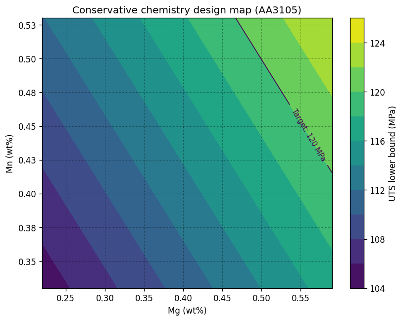

# Analytics Engineering Portfolio  
**From Industrial Data to Decision Tools Under Uncertainty**

---

## Why This Portfolio

In manufacturing, I learned that **operational impact matters more than technical elegance.**

Transitioning to data science, I've applied that same principle to build this portfolio:
- Data foundation before modeling  
- Conservative validation over metric chasing  
- Decision tools over equations  
- Systems over individual projects  

The work reflects my data engineering and analytics background:   
reproducible foundations (SC01), disciplined validation (SC02-SC04), and uncertainty-aware decision tools (SC05).

---

## Industrial Problem Context

This portfolio originated from a real quality problem in a flat-rolled aluminum operation.

Despite operating within AA specification limits, the organization experienced recurring quality issues and customer claims driven by **mechanical performance variability**—materials perceived as too hard, too soft, or unstable in downstream forming.

Root cause analysis revealed a structural gap:

- absence of internal chemistry standards,
- absence of internal mechanical performance targets,
- release decisions driven by compliance rather than design intent.

Physical trial campaigns to define internal standards were costly and operationally constrained.  
This portfolio explores whether **data-driven modeling** can act as a complementary design tool to define **conservative, defensible internal standards**.

---

## What This Portfolio Demonstrates

This portfolio documents how **industrial manufacturing data** transforms into **decision-ready engineering tools** used to define internal standards and reduce operational risk.

It demonstrates the ability to design and connect three elements as a coherent system:

- **Reproducible foundations** (SC01) — Stable semantics, explicit grain, traceability
- **Disciplined validation** (SC02-SC04) — Signal validation, conservative assumptions, honest results
- **Uncertainty-aware tools** (SC05) — Translating models into artifacts engineers can use

Rather than algorithmic novelty, the emphasis is on **trust, robustness, and decision value**, 
supporting standards definition, **risk reduction**, and **process stability**.



*Conservative chemistry design map showing predicted UTS across composition space (Mn vs Mg). The color gradient and target line enable engineers to identify safe operating regions at a glance.*

>In comparable industrial operations, this approach could deliver $250K-$800K annually through quality claim reduction, trial optimization, and faster standardization. Specific operational results remain proprietary.

---

## Portfolio as an Analytical System

Each study case answers a question raised by the previous one. Together, they form a coherent pipeline:

```
SC01: Reproducible Foundation
↓ Enables trustworthy analysis

SC02: Chemistry Signal Validation
↓ Chemistry contains sufficient signal for conservative model

SC03: Framework Generalization
↓ Framework generalizes, forms vary by system

SC04: Variable Screening
↓ Process variables add no incremental value under current scope

SC05: Uncertainty-Aware Tools
↓ Models become operational decision maps
```

---

### SC01 — Reproducible Analytics Foundation  
**From Excel-based analysis to a SQL semantic layer**

Your analytics live in 10 spreadsheets. Someone changes a formula. Nobody notices until the results diverge. You need a foundation that 
stays stable when you need it, scales when you grow it, and survives when people leave.  

[View Study Case →](https://github.com/ivvza-io/sc01-from-excel-to-sql-analytics)

→ Establishes trustworthy data as the prerequisite for everything.

---

### SC02 — Chemistry-Only Predictive Signal  
**Can chemistry alone support conservative UTS standards?**

You have chemistry. You have test results. You don't have time for 
expensive trials. This study validates that chemistry contains sufficient signal
—and shows how to reduce reliance on trial campaigns through data-driven targets.

[View Study Case →](https://github.com/ivvza-io/sc02-chemistry-only-mechanical-properties)

→ Demonstrates internal standards can be grounded in historical data instead of depending solely on experimental trials.

---

### SC03 — Generalization Across Alloy Systems  
**Does the framework generalize beyond a single system?**

You built a conservative, data-driven approach for Alloy A. Does that same philosophy work for Alloy B? Or does each system demand a different methodology? This study tests which approach transfers and which needs to adapt.

[View Study Case →](https://github.com/ivvza-io/sc03-chemistry-generalization-across-systems)

→ Evaluates framework transferability, showing that analytical approach generalizes while functional forms remain system-specific.

---

### SC04 — Variable Influence Screening  
**Does added complexity actually reduce uncertainty?**

Every variable you add increases risk: more failure modes, harder to maintain, easier to overfit. But which process variables actually help? 
Which are just correlation? This study assesses each rigorously, reporting findings without overinterpretation.

[View Study Case →](https://github.com/ivvza-io/sc04-variable-influence-screening)

→ Builds a decision framework for what belongs in a predictive model.  

---

### SC05 — Uncertainty-Aware Design Maps  
**Turning models into decision-ready engineering tools**

Models generate predictions. Operations need decisions. This study builds the translation layer: explicit colored decision maps that let 
engineers act on what the model learned, without needing to re-interpret the model itself.

[View Study Case →](https://github.com/ivvza-io/sc05-uncertainty-aware-design-maps)

→ The model's job is to learn. The map's job is to decide. Both are needed.

---

## Quick Start for Reviewers

> **Short on time?** Recommended reading paths:

- **5 min:** This overview + [Design Philosophy](#design-philosophy) below
- **15 min:** [SC05](https://github.com/ivvza-io/sc05-uncertainty-aware-design-maps) — end-state decision tools (uncertainty-aware maps)
- **30 min (rigor):** [SC01](https://github.com/ivvza-io/sc01-from-excel-to-sql-analytics) → [SC02](https://github.com/ivvza-io/sc02-chemistry-only-mechanical-properties) — foundation + baseline signal
- **Full narrative:** Read **SC01 → SC05** in order
- **Deep dive:** [README_EXTENDED](docs/README_EXTENDED.md) — portfolio-wide methodology and conventions

## How to Navigate the Portfolio (what you'll find)

- **README (per Study Case)**  
  Executive-level, decision-oriented summaries with minimal but sufficient evidence.

- **Technical Notes (per Study Case)**  
  Methodology, definitions, diagnostics, extended tables, and audit-level discussion.

- **Notebooks**  
  Full analytical evidence: code, experiments, and intermediate outputs.

- **README_EXTENDED — Analytical System and Design Philosophy**  
  Portfolio-wide principles, validation conventions, and design rules.  
  [Read the extended documentation →](docs/README_EXTENDED.md)

- **[Analytics Toolkit](https://github.com/ivvza-io/portfolio-analytics-toolkit)** *(separate repository)*  
  Shared utilities for consistent CV, metrics, uncertainty, and plotting across studies.

---

## Design Philosophy

This portfolio is built on four principles:

1. **Reproducibility before modeling** — No analysis without stable data semantics and explicit grain
2. **Signal before sophistication** — Validate signal exists before adding complexity
3. **Uncertainty as a first-class output** — Point predictions are insufficient for engineering decisions
4. **Engineering value over metric optimization** — Models exist to support decisions, not optimize leaderboards

For detailed methodology and analytical conventions: [Portfolio Design Documentation](docs/README_EXTENDED.md)

---

## The Approach

This portfolio is:
- **Grounded in operations**, not theory
- **Conservative by discipline**, not by default
- **Trustworthy by design**, not by luck

This means: pragmatic methods, conservative validation, and artifacts designed for adoption.

---

## Intended Audience

This work is most relevant for:

- Hiring managers evaluating **Senior Data Scientist / Analytics Engineer** profiles
- Industrial analytics and data platform teams
- Organizations operating under real variability, constraints, and risk

---

## Closing Statement

> **Complexity is not the goal.  
> Insight, trust, and decision value are.**

In operations, decisions are made with imperfect information—and they still must be defensible.
The goal is not to produce equations, but to produce **standards and tools** engineers can trust: clear assumptions, explicit uncertainty, and conservative margins.

This portfolio shows what that looks like end-to-end: from semantic foundations to decision maps.

---

## Next Steps

Each study case can be explored independently, but the full value emerges when read as a system, from data foundations to decision tools.

Start with [**SC01**](https://github.com/ivvza-io/sc01-from-excel-to-sql-analytics) for context, or jump directly to [**SC05**](https://github.com/ivvza-io/sc05-uncertainty-aware-design-maps) to see the end-state.

---